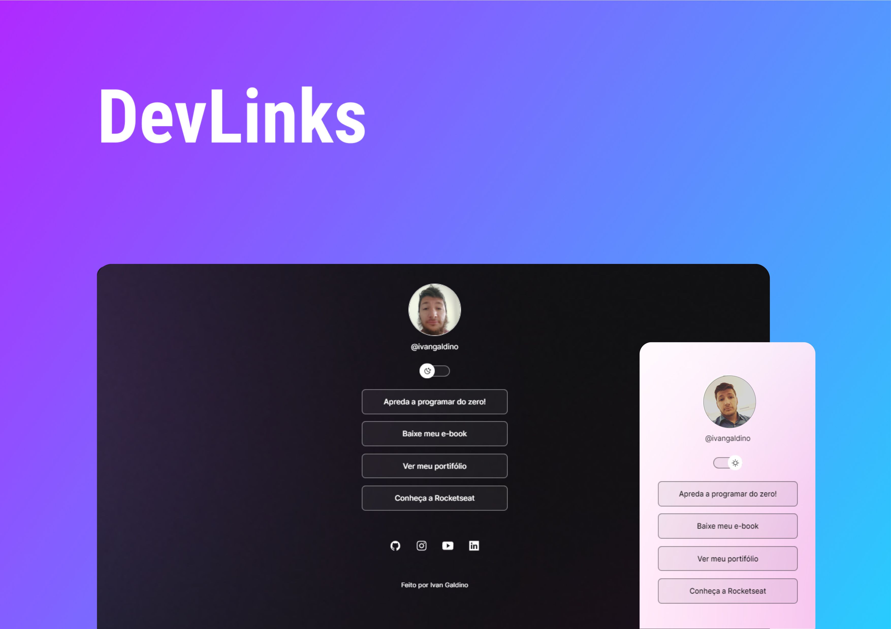

<h1 align="center"> Cartão de Visita </h1>

  <a href="#-tecnologias">Tecnologias</a>&nbsp;&nbsp;&nbsp;|&nbsp;&nbsp;&nbsp;
  <a href="#-projeto">Projeto</a>&nbsp;&nbsp;&nbsp;|&nbsp;&nbsp;&nbsp;
  <a href="#memo-licença">Licença</a>

  

##

  

## 🚀 Tecnologias

Esse projeto foi desenvolvido com as seguintes tecnologias:

- HTML e CSS
- JavaScript
- Git e Github

## 💻 Projeto

É um agregador de links para usar como cartão de visitas online.

- [Acesse o projeto finalizado, online](https://lordipg.github.io/Projeto/)

## :memo: Licença

Esse projeto está sob a licença MIT.
 

##

by Ivan Galdino
